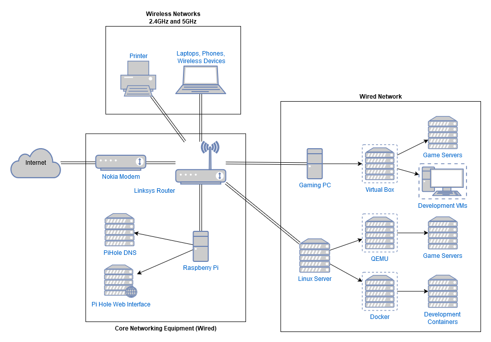

# Homelab Network Setup

Here’s an overview of my home networking and lab setup, showing off how I’ve learned and applied various skills in networking, server management, virtualization, and containerization.

## **Key Skills**

- **Networking & Infrastructure:** Router configuration, DNS filtering with PiHole, network management
- **Virtualization:** VirtualBox, QEMU, Docker—setting up VMs and containers
- **Server Management:** Linux server management, game server hosting, system monitoring
- **Development Tools:** WSL (Windows Subsystem for Linux), Docker, Visual Studio Code, Git, gaming setup optimizations
- **Troubleshooting:** Network performance, firewall configuration, scaling virtual environments

## Key Components

- **Linksys WRT3200 ACM Wireless Router**
- **Nokia Fiber Modem**
- **Raspberry Pi 3b+ (PiHole DNS Server)**
- **Gaming PC (Main Workstation)**
- **Linux Server (Virtualization & Game Servers)**
- **Printer & Various Wireless Devices** (Phones, Roku, etc.)

## Network Diagram

## Key Components Breakdown

### 1. **Nokia Fiber Modem**

This modem is provided by my ISP and it converts fiber optic signals into Ethernet. It gives the whole network reliable and fast internet access.

### 2. **Linksys WRT3200 ACM Wireless Router**

I picked this router up at a great discount while in college, and it’s been serving me well ever since. It’s a bit of a Swiss army knife—acting as a router, wireless access point, 4-port switch, and more. Right now, it’s running the stock firmware, but I’ve configured it to handle port forwarding for game servers and set up a basic firewall for additional security.

### 3. **Raspberry Pi 3B+ (PiHole DNS Server)**

This little Pi is running PiHole as my network-wide DNS server to block ads and unwanted traffic. The router points to it for DNS resolution, which helps improve browsing speeds and security by cutting out all those ads. I can manage PiHole through its own web interface, and it’s been a useful tool for keeping the network cleaner.

Check out the [PiHole Project](https://docs.pi-hole.net/) if you are interested in running your own.

### 4. **Gaming PC**

This has been my daily workstation for the past 8 years. I built my first PC around 2016, and this one’s been through multiple upgrades since then. It’s still in the same chassis I started with, but inside, there’s a whole new set of components. Right now, it’s my go-to for gaming, schoolwork, and development tasks.

#### Specs:

- **CPU:** AMD Ryzen 7 5700X (8-core)
- **RAM:** 40GB DDR4
- **Storage:**
  - 500GB SSD for OS & programs
  - 500GB SSD for fast access to commonly used programs
  - 1TB SSD for bulk storage
  - 1TB SDD for archiving
- **GPU:** MSI Duke Nvidia GTX 1080 8GB VRAM
- **Motherboard:** Asus B350M-Plus Gaming
- **OS:** Windows 10

#### Common Tools & Software:

- **Development:** Visual Studio Code, GitHub Desktop, Git
- **Networking & Monitoring:** Wireshark, VirtualBox, Microsoft PowerToys
- **Gaming & Productivity:** SumatraPDF, Discord, Microsoft PowerToys
- **AI and ML**: ComfyUI, Koboldcpp

When setting up a new computer I use [Ninite](www.ninite.com) to bulk install common programs.

#### Future Upgrades:

- **New GPU:** My GTX 1080 is still handling 1080p gaming just fine, but I plan to upgrade soon, mainly for AI experiments and testing new tools.
- **Linux Migration:** I’m leaning towards migrating to Linux for daily tasks, as I no longer game as much, and Windows’ extra features (like Cortana and Recall) I'm not a fan of.

### 5. **Linux Server**

I scored a pretty sweet deal on an HP Victus Gaming PC, which I’ve turned into a dedicated Linux server. It now runs Ubuntu and hosts lightweight virtual machines (VMs) using QEMU. Right now, I host a few game servers (Minecraft, Terraria, Valheim, and Palworld) on this machine.

#### What I Learned:

- Managing **Linux servers** with no physical input—everything is done remotely via RDP.
- Running **Docker containers** and **QEMU VMs** for game server hosting and learning how to handle networking and resource allocation.

## Additional Skills & Learning:

- **Network Performance Monitoring:** I’ve used Wireshark to troubleshoot and optimize network performance for smoother connections.
- **Firewall Configurations:** I’ve learned how to configure firewalls to secure my network to keep unwanted traffic out and allow wanted traffic in.
- **Resource Scaling & Management:** I now know how to scale virtual machines and monitor resource usage to optimize my setup based on demand.

## Future Plans

- Expanded Virtualization: Setup a Kubernetes cluser to pratice orchestration
- Intrusion Detection System/Intrusion Prevnetion System: Setup and use snort to monitor and protect the network
- Cloud Integration: Cloud storage for backups and use the cloud as a status dashboard to monitor game server health.
- Cloud Expirments: Using my Azure credits from school to buld a cloud-based honeypot for testing attack dection with Sentinel.
