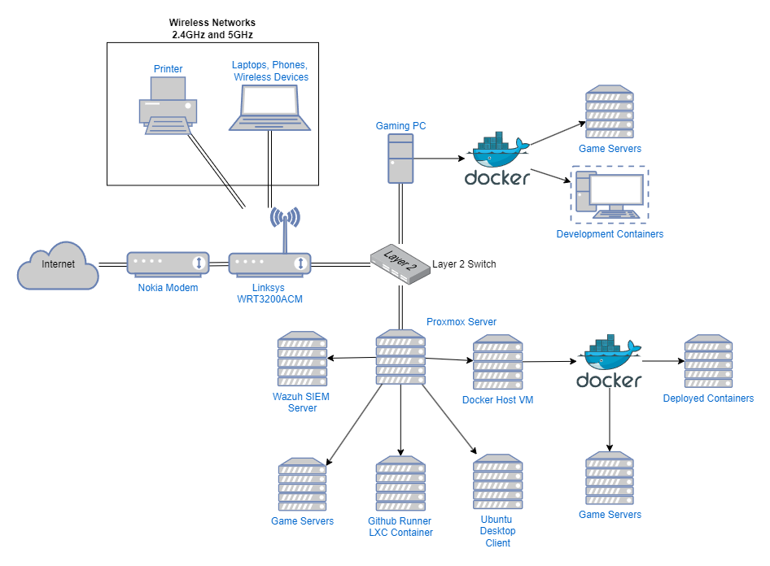

# **Homelab Network & Virtualization Setup**

This is my **homelab setup**, where I explore **virtualization, security monitoring, and server hosting** while applying automation techniques to make management easier.

---

## **Current Homelab Setup**



### **Network & Hardware**

- **Nokia Fiber Modem** – ISP-provided, converts fiber to Ethernet
- **Linksys WRT3200 ACM Router** – Manages DHCP, firewall, and port forwarding
- **Gaming PC (Main Workstation)** – Daily driver for gaming & development
- **Proxmox Server (Former Linux Server)** – Runs virtual machines and containers
- **Various IoT Devices** – Smart devices, printer, Roku, etc.

### **Virtualization with Proxmox**

I converted my **Linux server into a Proxmox hypervisor**, allowing me to:

- **Host multiple VMs and containers** efficiently
- **Run security monitoring & logging tools**
- **Isolate workloads** (game servers, monitoring, experiments)

#### **What’s Running on Proxmox?**

| VM/Container       | Purpose                                                                     |
| ------------------ | --------------------------------------------------------------------------- |
| **Game-Servers**   | Hosting Minecraft, Terraria, Valheim, Palworld                              |
| **SIEM**           | Runs Wazuh for security monitoring                                          |
| **Docker**         | for testing, building, and deploying docker containers.                     |
| **GitHub Runner**  | Integrates with github for Continuous Integration and Continuous Deployment |
| **Ubuntu Desktop** | To explore linux and practice sysadmin skills                               |

---

## **Automation & Security Enhancements**

### **1. Firewall Automation (Threat Aggregator Integration)**

I wrote a threat intelligence feed aggretator [here](https://github.com/AyyyStew/ThreatAggregator). This is hosted in my docker host vm.

This repository contains a **PowerShell script (`automateAddingToWindowsFirewall.ps1`)** that:

- **Fetches malicious IPs from my Threat Aggregator API**
- **Automatically adds firewall rules** to Windows Defender Firewall
- Blocks **known malicious connections**

#### **Running the Script Manually:**

```powershell
.\automateAddingToWindowsFirewall.ps1
```

_(I use Windows Task Scheduler to run this daily.)_

---

### **2. Security Monitoring with Wazuh**

I use **Wazuh**, a security-focused **SIEM (Security Information and Event Management)** tool. Each VM gets a Wazuh agent that collects logs that allows me to:

- **Monitor logs for suspicious activity**
- **Detect security threats** across my network
- **Provide centralized logging for my Proxmox server & VMs**

---

## **Game Server Hosting**

I host **Minecraft, Terraria, Valheim, and Palworld servers** on a dedicated VM.

- **Manual start/stop via Proxmox** (not automated yet)
- **Port forwarding through the router** for remote access
- **Basic monitoring** to track uptime and resource usage

_(Right now, there’s no demand for automated scaling, but I may experiment with it in the future.)_

---

## **Workstation Setup**

I have a custom built PC I've been using as my daily driver for under 10 years. The PC has evolved a lot over the years but here are the current specs:

**Specs:**

- **CPU:** AMD Ryzen 7 5700X (8-core)
- **RAM:** 40GB DDR4
- **Storage:** Multiple SSDs for different workloads
- **GPU:** MSI Duke Nvidia GTX 1080
- **OS:** Windows 10

### **Software & Tools**

- **Development:** VS Code, GitHub Desktop, Docker, WSL
- **Networking & Monitoring:** Wireshark, SSH, PowerShell
- **Security:** Wazuh, Windows Defender, Malwarebytes (when needed), Private Internet Access VPN

When setting up a new PC, I use [Ninite](https://www.ninite.com) for bulk installs:

---

## **Future Plans & Enhancements**

✅ **Expand Wazuh logging to more devices**  
✅ **Set up a small cloud-based project with my Azure credits**  
✅ **Experiment with Grafana dashboards for security insights**  
✅ **Explore automating backups for game servers & configs**

---

## **Final Thoughts**

This homelab is a **work-in-progress**, helping me learn **virtualization, security monitoring, and automation** while hosting services I actually use. As I expand my knowledge, I plan to integrate **more security tools, automation, and monitoring improvements** over time.
